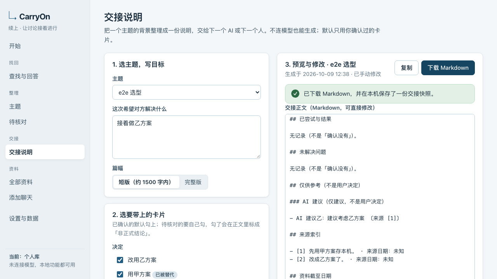

[English](README.md) | [简体中文](README.zh-CN.md)

# CarryOn · 续上

**Find the source. Review the decision. Carry the context forward.**

Continue where the last conversation left off. Turn chats you choose to import into traceable decisions, open questions, and an editable handoff for the next conversation.



**Local first, single user, Chinese interface.** No model is required for importing, keyword search, manual cards, template handoffs, or backup and restore. Optional AI uses an OpenAI-compatible Chat Completions endpoint that you configure yourself.

This is an early public beta. The local workflows have been tested with synthetic material. Real model quality and usefulness on private chats have not been verified.

## Run locally

Requires Node.js **22.14.0 or newer**, npm, and macOS or Linux. Automated checks cover Node 22 and 24. The application uses Node's built-in SQLite.

```sh
git clone https://github.com/bigu1/CarryOn.git
cd CarryOn
npm ci
npm run build
sh scripts/start.sh
```

Open the printed address (default `http://127.0.0.1:43173`). The launcher tries the next port if it is occupied. To stop the same instance:

```sh
sh scripts/stop.sh
```

For development, run `npm run dev`. For a custom data location:

```sh
XUSHANG_DATA_DIR=./local-data sh scripts/start.sh
XUSHANG_DATA_DIR=./local-data sh scripts/stop.sh
```

## A useful first session

1. Choose the synthetic demo or paste/import UTF-8 TXT, Markdown, or the application's [JSON v1 format](schemas/json-v1.schema.json).
2. Check the preview's speakers, dates, and topic before confirming. Cancelled previews never enter the library.
3. Search for a word, open its original context, then select text or use “整段建卡” to make a card. AI suggestions and user decisions are separate.
4. Review candidates individually. “Confirmed” means the summary matches the source, not that a historical claim has been independently verified.
5. Select a topic and this session's goal in “交接说明”. Preview, edit, copy, or download Markdown. Unknowns and unresolved questions remain visible.
6. Export a backup in “设置与数据”. A backup contains private chats; keep it private. Restore validates a replacement database and preserves a local snapshot of the previous library.

## Data and AI boundaries

- The service binds to loopback only. Host, Origin, session and CSRF checks protect writes. It is a local tool; do not expose it through a tunnel or public reverse proxy.
- Data lives under `data/` by default, separate from browser storage. Personal and demo libraries are separate. No telemetry, remote fonts, clipboard monitoring, or automatic reading of other AI applications.
- Model credentials remain in server process memory. They are excluded from database and backup and cleared on restart. Each browser send begins with a scope preview; changed material or settings require a new preview.
- Remote model endpoints require HTTPS; loopback HTTP is allowed. Redirects are rejected. Input, output, timeout, retry and cancellation limits are enforced.
- A source deletion clears app-visible text and invalidates dependent content and late model results. Previously downloaded files and pre-restore snapshots cannot be recalled automatically. This is not forensic disk erasure.
- Citations are checked for scope and literal text. That does not prove a model's interpretation is correct; human review remains necessary.

## Naming and compatibility

The English product name is **CarryOn**; the Chinese name is **续上**. The repository and package use CarryOn / `carryon`. Older `xushang.db`, `xushang-backup`, cookies and `XUSHANG_*` environment variables remain supported storage/protocol identifiers so an existing library and backup keep working. They are not a second product name.

Copyright and public commit attribution belong to **bigu1**. Commits use the account's GitHub-provided no-reply address to protect the real email address.

## Checks and project map

```sh
npm run typecheck
npm test
npm run build
npx playwright install chromium
npm run test:e2e
npm audit
npm run check:public
```

Browser tests create a fresh temporary library on a separate port and refuse the default daily-use port. `npm run perf:20k` creates its own synthetic database; its timings are specific to the machine running it.

`src/client/` holds the interface and reusable components; `src/server/routes/` the HTTP boundaries; `src/domain/` card and handoff rules; `src/importers/` preview parsing; `src/search/` literal search; `src/ai/` send plans and model jobs; `src/storage/` SQLite, deletion and validated backup replacement.

Read the [original product contract](docs/specification/01-产品与实现方案.md), [current acceptance evidence](docs/ACCEPTANCE.md), [runbook](docs/RUNBOOK.md), and [security policy](SECURITY.md), and [privacy and attribution audit](docs/PRIVACY_AUDIT.md). The repository and release contain source, tests, synthetic fixtures and documentation, never a personal library or previous private Git history.

## Contributing and license

See [CONTRIBUTING.md](CONTRIBUTING.md). Licensed under [MIT](LICENSE).
