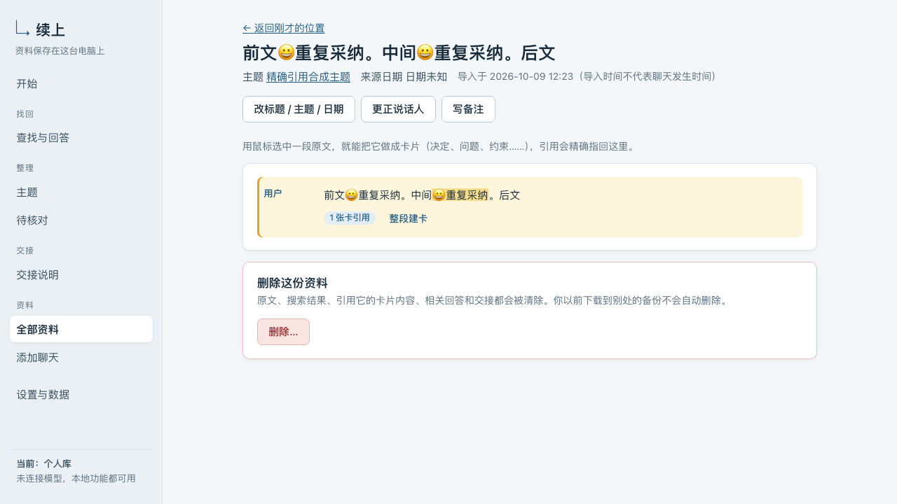
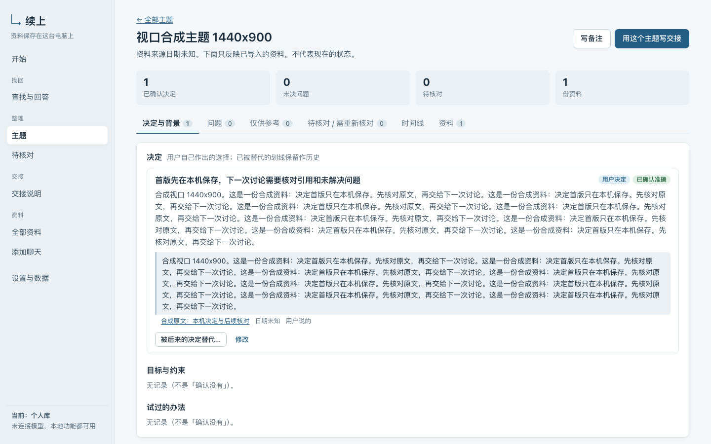
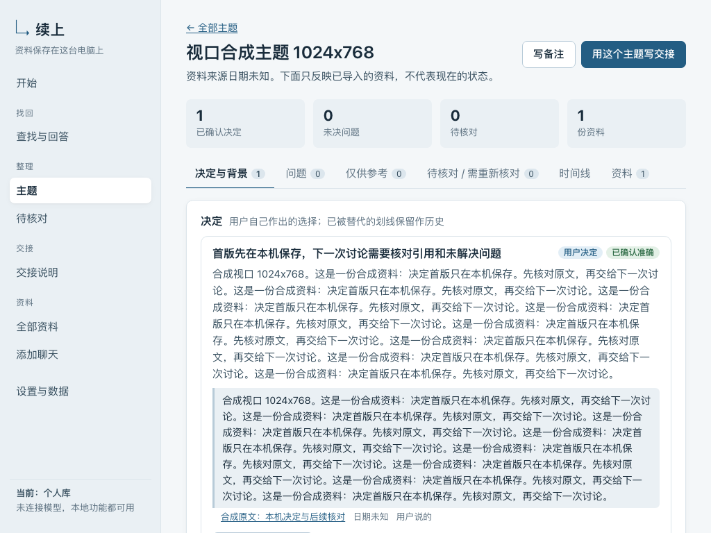
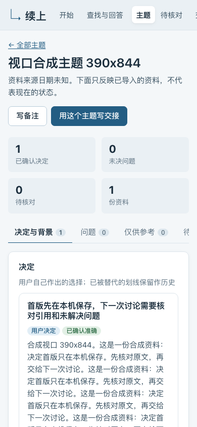

# 首版逐项验收证据

2026-10-09，`1.0.0-beta.2`。PASS 仅表示这里列出的当前代码与合成场景通过；不表示未知缺陷为零，也不代表真实聊天价值或真实模型质量已通过。原始要求仍见 [规格](specification/02-验收与交付要求.md)。

可重跑的集成用例：[core](../tests/integration/core.test.ts)、[F01–F09](../tests/integration/fxx-regression.test.ts)、[整改回归](../tests/integration/rework.test.ts)、[发布边界](../tests/integration/public-release.test.ts)、[模拟 AI](../tests/integration/ai.test.ts)。浏览器用例：[主流程](../tests/e2e/flows.spec.ts)、[模拟模型与备份](../tests/e2e/model-and-backup.spec.ts)、[视口](../tests/e2e/viewports.spec.ts)。测试只创建新的临时库。

## 本地核心

| ID | 当前状态 | 本轮证据与具体边界 |
| --- | --- | --- |
| C01 | PASS | 干净源码副本 npm ci、类型检查、构建；CI 在 macOS/Linux × Node 22/24 执行同一套检查。支持版本、启动步骤写在双语 README。 |
| C02 | PASS | 浏览器空库进入、合成演示入口；无模型时导入/查找/手工卡片/交接可用，AI 控件说明需连接服务。另有隔离页面人工走查。 |
| C03 | PASS | core C03 对粘贴/TXT/Markdown/JSON 确认入库及预览取消作计数断言；浏览器粘贴和多文件导入。 |
| C04 | PASS | core C04 unknown 与日期精度、预览角色更正；界面明确导入时间不代表发生时间。 |
| C05 | PASS | core C05 分别覆盖代码块/引用块；浏览器查看脚本及角色示例仍为资料。 |
| C06 | PASS | core C06 同内容换文件名的入库计数保持不变；未重复建立来源或卡片。 |
| C07 | PASS | core C07 修订保存；F05/L6 旧引用待核对，旧原文可打开；发布边界验证修订后迟到结果不写回。 |
| C08 | PASS | core C08 超限、空输入、乱码、坏 JSON、未知版本不产生半份资料；上传严格 UTF-8 解码，浏览器真实坏字节文件被拒绝，其余可继续。 |
| C09 | PASS | core C09 中文单字/短词/词组与英文数字查询；浏览器查找命中原文。性能另以 20,000 条合成消息检查，不外推真实资料。 |
| C10 | PASS | core C10 字面百分号、下划线、引号与参数化查询；不会扩大为通配匹配。 |
| C11 | PASS | core C11 分页与角色/主题/日期/unknown；浏览器按主题、用户角色、日期与 unknown 筛选，25 条分两页，返回保留第二页和全部筛选。 |
| C12 | PASS | 同段中文/emoji 重复摘录选中第二处，API 保存码点、浏览器高亮第二处及前后文，返回主题；搜索回跳也保留筛选和页码。错位置/非整数/无位置歧义引用拒绝。截图见下文。 |
| C13 | PASS | 浏览器原文选中建卡、用户备注独立标记；API 建立并修改卡片。macOS 隔离进程真正停止再启动后，备份 data 中资料/卡片/修订/引用/替代/交接逐表完全一致。 |
| C14 | PASS | core C14 修改/确认/拒绝状态；模拟模型浏览器生成候选后逐条人工确认。拒绝卡片不进入已确认结论。 |
| C15 | PASS | core C15 与整改回归替代、撤销、失效一端后的旧决定恢复；浏览器同主题旧决定/新决定人工确认替代并保留历史。 |
| C16 | PASS | core C16 跨主题明确拒绝；交接未知日期保持未知，不按导入顺序宣布最新。 |
| C17 | PASS | 两份隔离库真实生成的 [短版](examples/handoff-short.md) / [完整版](examples/handoff-full.md)，目标、背景、决定、尝试、问题、限制、来源、未知日期齐全；不代表用户认可真实使用价值。 |
| C18 | PASS | 浏览器读取实际剪贴板，与编辑器正文完全相同；下载文件也逐字相同。core C18/L2 验证候选必须显式选择且有标记；选择改变后旧正文不能直接导出。 |
| C19 | PASS | core C19 长主题与短版超长提示未包含项；F03 保留约束和未核验/冲突状态，不静默移除。 |
| C20 | PASS | core C20/F01/L3 数据与 API 查原文/索引/正文/派生输出/新备份；浏览器删除影响确认及删除后搜索为 0；旧交接晚保存拒绝。外部旧下载不自动擦除。 |
| C21 | PASS | 可控制延迟的有效模型响应，在删除、角色更正、内容修订后均不能写回；引用旧消息仍存在也会被版本校验阻止。 |
| C22 | PASS | core C22 来源/卡片/引用/替代恢复与凭据排除；浏览器下载个人库备份，恢复到演示库，再下载 data 逐表相等，个人库保留。 |
| C23 | PASS | core C23 与发布边界：损坏哈希、缺表、版本/结构不兼容、有效哈希但坏外键的备份拒绝；原库内容不变，新库先完整性检查再原子替换。 |
| C24 | PASS | macOS 隔离进程重启完整持久化；模型凭据清空；core C24 演示重置不影响个人库，浏览器两库恢复隔离。Linux 进程启停现场未单独验证。 |
| C25 | PASS (macOS) | 中文含空格路径现场执行、端口占用后换端口且旧监听保留、再次启动复用 PID、停止及重启；另一实例与 PID 路径前缀碰撞均拒绝误杀。F09 回归保留。Linux 启停现场未验证。 |
| C26 | PASS | core C26 错误 Host、跨源 Origin、端口不匹配、CSRF 拒绝；浏览器合法本机写入正常。 |
| C27 | PASS | 浏览器脚本/HTML/远程 Markdown 图片均按文字显示，脚本未执行，远端图没有网络请求；文件名仅作为元数据，导入不按文件名写磁盘路径。 |
| C28 | PASS | 浏览器无模型主流程请求记录只有回环地址；字体/样式/脚本随本地构建，无遥测或 CDN，服务代码没有无模型外发业务路径。 |
| C29 | PASS | 1440×900、1024×768、390×844 实际渲染全部路由，包含已导入资料详情与主题详情，无横向溢出；键盘焦点可见；导入错误显示来源文件。下方提供三视口截图。 |
| C30 | PASS | 浏览器多文件中有效/空/坏 JSON/坏 UTF-8 逐份报告且只入可用资料；core C30 部分失败；AI 模拟限流重试上限、取消不写入、迟到结果丢弃及任务恢复。 |

## AI 协议与真实服务

| ID | 当前状态 | 证据或未执行原因 |
| --- | --- | --- |
| A01 | PASS (模拟) | 凭据只在服务端内存；备份/库不含合成凭据；隔离进程重启后 configured=false。公开源码与历史经扫描。 |
| A02 | PASS (模拟) | 未确认不发送；明确空范围不扩大全库；选择子集不夹带其他卡片；预览绑定问题/资料/角色/模型，变更拒绝旧预览。浏览器完成发送范围核对。 |
| A03 | PASS (模拟) | 独立 HTTP 故障：401、403、429、空响应、坏 JSON、null/非文本结构、过大响应、超时、重定向、取消；任务最多重试一次，达到上限失败可见。输入/输出/读取预算独立。 |
| A04 | PASS (模拟) | 坏引用/越范围/错位置不入库；pending 候选去重；删除、角色更正、修订竞态有效响应丢弃。歧义重复摘录拒绝，回答缺证据或坏结构不保存。 |
| A05 | NOT_RUN | 未授权真实模型服务及预算；模拟提炼不能证明真实内容质量。 |
| A06 | NOT_RUN | 未向真实模型提交 5 个问题，不能把本机模拟回答当成真实回答验收。 |
| A07 | NOT_RUN | 时间/冲突规则的工程验证已做，真实模型判断能力未验证。 |
| A08 | NOT_RUN | 长输入、覆盖、预算及失败模拟已做，真实长资料实测未做。 |
| A09 | NOT_RUN | 模拟润色流程已做，真实模型两份润色质量未验证。 |
| A10 | NOT_RUN | 无真实调用，因此没有真实服务/模型返回标识/用量/费用记录；不得虚构。 |

真实聊天价值实验保留为 NOT_RUN：没有读取私人资料，未做 20 段聊天 / 5 个历史问题 / 2 份用户认可交接的前后对比。原方案允许未获资料授权时先以合成材料做工程验收，真实使用保留待办；没有改松要求。

## 浏览器渲染记录

以下都是隔离合成库，未包含私人聊天：

## 发布判定

当前已验证的本地核心和模拟协议可作为公开 beta；真实模型和真实使用项保持 NOT_RUN。以源码白名单发布、MIT 许可、双语 README、依赖审计和公开文件门禁，使用全新的公开 Git 历史，不搬运原工程的私人历史、运行库或日志。GitHub Actions 的每个运行绑定提交，发布说明给出对应最终运行链接。
